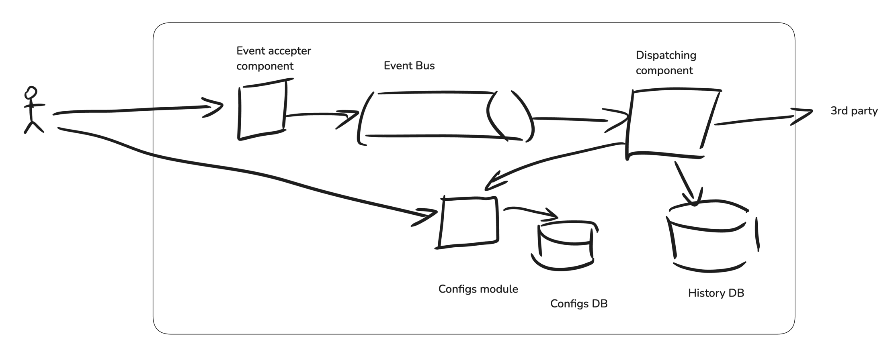

# FlowGate

Toy project that implements event-gateway architectural pattern in Golang.

## Infrastructure

Database: PostgreSQL (will be switched to homegrown db later *hopefully*).  
Event bus: Kafka.  
Metrics: ?  

## Architecture diagram sketch

## Requirements

1. System is able to save submitted event
2. System dispatches submitted events to configured endpoints
3. System is able to handle high 3rd party endpoint failures
4. System is able to handle 1000+ requests per second

## Config structure

- Event type 
- Target endpoint 
- Static send parameters (auth, etc)

## Event submit request params

- Event type as `event-type` HTTP header
- Event body as request body
- API token as `authorization` header
